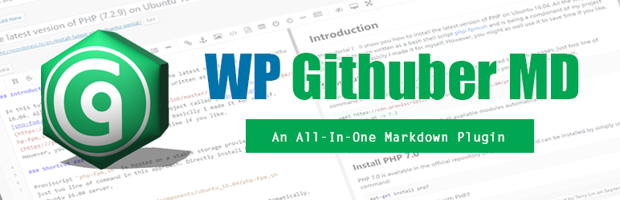
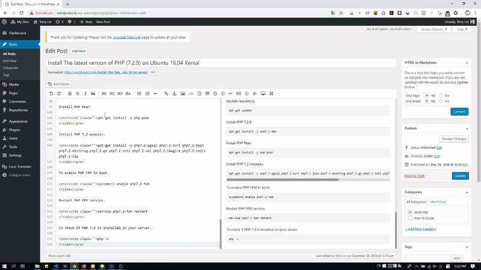
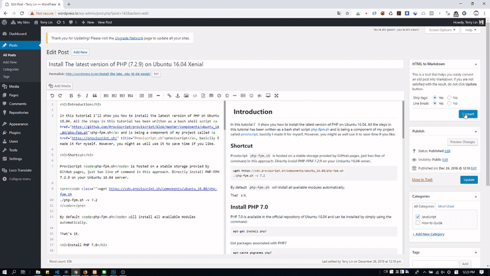
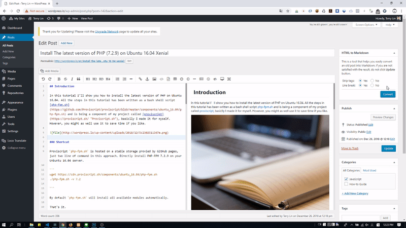

# Markdown editor plugin for WordPress

An all-in-on [WordPress Markdown Plugin](https://terryl.in/en/repository/wordpress-markdown-plugin-githuber-md/) provides a variety of features such as Markdown editor, live-preview, image-paste, HTML-to-Markdown helper, and more..

## How it works

1. WP Githuber MD will save your Markdown content into `wp_posts`.`post_content_filtered`.
2. Parse the Markdown to HTML, save the parsed HTML content into `wp_posts`.`post_content`.

This plugin will detect your Markdown content and decide what scripts will be loaded, to avoid loading unnecessary scripts.
For example, if you enabled `syntax highlight`, you have to update your post again to take effects.

## Demo

### GIF animation

The demo shows you the following steps:

1. Convert HTML to Markdown by using `HTML to Markdown` tool.

2. Cut up a selection area of an image and copy it from Photoshop, then paste it to Markdown Editor.

3. Click "Update" button to save Markdown to `post_content_filtered` and save HTML to `post_content` (it is what you will see in result). 
4. View the result.

### Video

https://youtu.be/it1noNCTXa4

## Requirement

* PHP version > 5.3.0
* WordPress version > 4.0
* Tested up to 5.5.1

## Download

| source | download | 
| --- | --- | 
| WordPress | https://wordpress.org/plugins/wp-githuber-md |
| GitHub repository | https://github.com/terrylinooo/githuber-md/releases | 
| PHP Composer | `composer create-project terrylinooo/githuber-md wp-githuber-md` |

## Installation

1. Upload the plugin files to the `/wp-content/plugins/wp-githuber-md` directory, or install the plugin through the WordPress plugins screen directly.
2. Activate the plugin through the `Plugins` screen in WordPress.
3. Go to the `WP Githuber MD` menu in Plugins and set your Markdown options.

## Suggestions

The better situation to use this plugin is you just started a new blog.

If you're planning to use this plugin in an existing blog, be sure to:

- Turn off other Markdown plugins, because the similar plugins might do the same things when submitting your posts, may have some syntax conversion issues between Markdown and HTML.
- My personal suggestion is to turn off `revision` and `auto-save`, there are options in setting page.

## Features

* All-in-one [Markdown editor](https://markdown-editor.github.io/).
* Live preview.
* Spell check.
* Enable / disable Markdown for single post.
* Support Gutenberg editor.
* Support custom post types.
* HTML-to-Markdown helper
* Image copy & paste (support uploading to Imgur.com and sm.ms)
* Syntax highlight.
* Flow chart.
* KaTex.
* Sequence diagram.
* Mermaid.
* MathJax.
* Emoji.
* Github flavored Markdown task list.
* Markdown extra...
* Keyword suggestion tool.

## Sceenshots

|  | thumbnail | screenshot | description |
| --- | --- | --- | --- |
| Image copy & paste |  | [view](https://i.imgur.com/FObsHBG.gif) | Uplaoding images becomes much more eaiser, just copy and paste, then done. You can upload to your `upload` folder or host your images to `Imgur.com`. |
| HTML to Markdown |  |[view](https://i.imgur.com/DmLhnXM.gif) | Convert your old posts into Markdown by using HTML-to-Markdown helper that beside the Editor. |
| Syntax Highlighing |   |[view](https://i.imgur.com/sJclXdR.gif) | Use Google `prettify.js` for the Editor's live-preview pane, and use `prism.js` for the fontend pages. You can choose your favorite theme for syntax hgihlighing. |
| Mermaid |  | [view](https://i.imgur.com/6dfCQT6.gif) | Mermaid is a Markdownish syntax for generating flowcharts, sequence diagrams, class diagrams, gantt charts and git graphs.
| KaTex |  | [view](https://i.imgur.com/ZWUaNNO.gif) | KaTex is a fast, easy-to-use JavaScript library for TeX math rendering on the web. |
| Flow Chart |  | [view](https://i.imgur.com/3ZQRuwQ.gif) | Draws simple SVG flow chart diagrams from textual representation of the diagram. |
| Sequence Diagram |  | [view](https://i.imgur.com/P7ymz9a.gif) | Turns Text Into Vector UML sequence diagrams. |
| Setting Page 1 |  | [view](https://i.imgur.com/0yhHBhL.gif) | Markdown settings. |
| Setting page 2 |  | [view](https://i.imgur.com/Va8z7Jg.gif) | Modules settings. |

### Author

Created by [Terry L.](https://terryl.in) and contributors.
Thanks for the [donators](https://terryl.in/thank-you/) for supporting me, and the translators such as [CoLocal](https://colocal.com/) and others for providing translation.

### Notes

- [Changelog](https://github.com/terrylinooo/githuber-md/wiki/Changelog) 
- [Translations](https://github.com/terrylinooo/githuber-md/wiki/Translations)
- [Known issues](https://github.com/terrylinooo/githuber-md/wiki/Known-Issues)
- 

### License

GPLv3 or later
